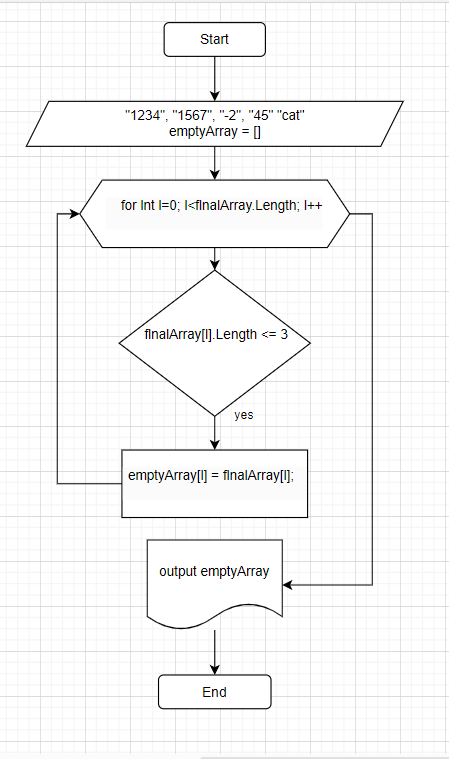

# Решение задачи итогового проекта. 
1. Создаем файлы проекта с помощью команды ***dotnet new console***.
2. В файле с расширением ***.cs*** пишем код:
+ создаем метод вывода строкового массива на экран
```
void ShowArray(string[] array)
{
    for (int i = 0; i < array.Length; i++)
    {
        Console.Write(array[i] + " ");
    }
    Console.WriteLine();
}
```
+  создаем массив, указываем его рамерность:

```
string[] finalArray = { "1234", "1567", "-2", "45", "cat" };
string[] emptyArray = new string[10];
```
+ далее используем цикл *for* и добавляем условие в цикла, указываем длину массива и счетчик. При выполнение цикл будет проходить по массиву пока не будет выполнено заданное условие. 
```
for (int i = 0; i < finalArray.Length; i++)
```

+ по условию задачи длина строки должна быть меньше либо равная 3 символам. Добавляем это условие используя оператор ветвления __if__.
```
for (int i = 0; i < finalArray.Length; i++)
{
    if (finalArray[i].Length <= 3)
    {
        emptyArray[i] = finalArray[i];
    }
}
```
+ используя метод **_ShowArray_** выводим получившийся массив на экран
```
ShowArray(emptyArray);
```
3. Добавляем блок-схему алгоритма решения задачи.

     


4. Добавляем файл __gitignore__.
5. Запушиваем решение в раннее созданный репозиторий на *Github*.